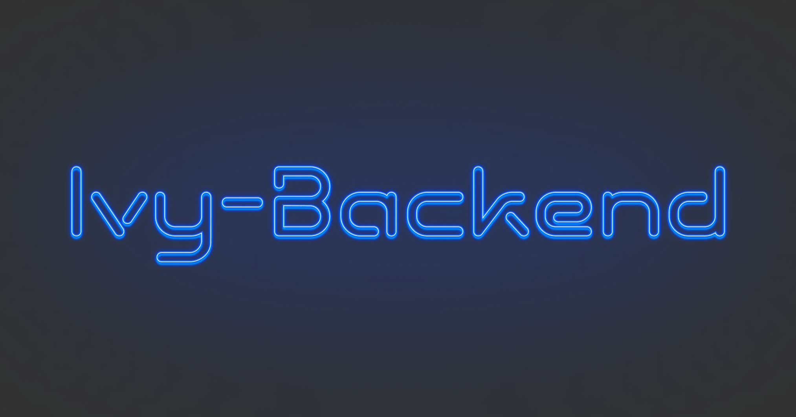
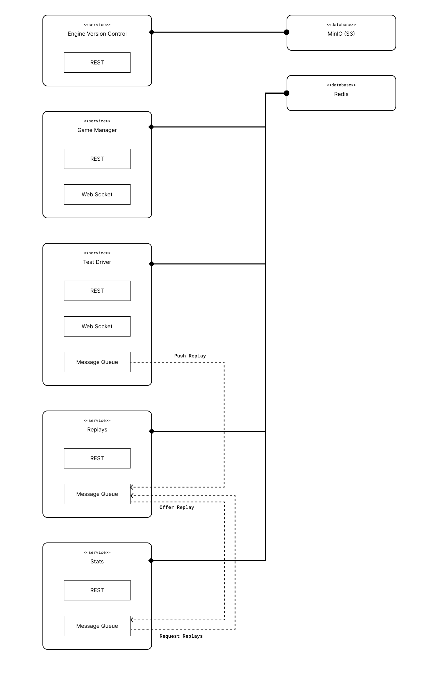

<p>
    
</p>

<p>
    
    
    </a>
</p>

# Ivy - Backend

This monorepo contains the codebase for the microservices that form
the backend of the chess engine Ivy.

## 🎉 Motivation

Writing a chess engine, or any other piece of software with highly messurable performance metrics, requires a strong regression testing framework.
In case of open source game playing software a distributed testing environment is also an important factor.
`Ivy Backend` can be compared to Fishtest used and maintained by the Stockfish team. This solution is focused on providing
a centralized testing and management environment for the Ivy chess engine. It includes different services required for a sound testing
solution in the context of chess engines. Different services provide capabilities to manage engine versions and their different flavours (e.g. OS, ISA, extensions),
distribute tests on many different physical client devices, record replays, analyze replays and more to come.

## 📖 Project Overview

The project is based on [Turbo Repo](https://turbo.build).

- `apps/*`: Code base for the deployed microservices
- `packages/*`: Internal and public packages used by different services

For more information about the different apps have a look at their
README files, located at the root of each package / app.

### App Structure

An app or service contains two subdirectories: `service` and `api`. `service` contains the business logic
for each app, while `api` defines the ways of communication to external or internal systems. You will find
there routers for REST APIs, web socket servers or listeners on internal message queues.

## 🔥 Getting Started

### Install Prerequisites

- [Docker](https://www.docker.com/products/docker-desktop/)
- [NodeJS](https://nodejs.org/en/download)
- [Yarn](https://classic.yarnpkg.com/en/)

### Setup Dev Environment

```sh
# Start external services
docker compose up

# Install dependencies
yarn install

# Start dev server in watch mode
yarn dev

# Run tests
yarn test

# Run linter
yarn lint
```

## 🧱 System Structure

<p>
    
</p>

## 🧑‍⚖️ License

This project and all components of it are distributed under GPLv3 or later.
See `LICENSE` for more details. In summary the license allows anyone to use and redistribute
this project as long as the code is again published under GPLv3.
